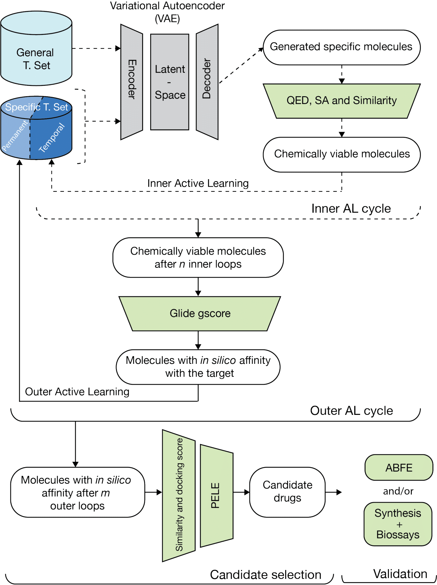

<a id="readme-top"></a>

[](https://arxiv.org/abs/2305.06334)
[](./LICENSE)
[](https://www.python.org/)
[](https://github.com/IFilella/ALGen-1)


# ALGen-1

✨**ALGen**✨ is the main component of a molecular generative modeling (GM) workflow designed to generate novel chemical compounds with desired properties. ALGen encompasses the **initial stages** of the workflow illustrated in *Figure 1*, from data preprocessing through molecule generation and the implementation of the inner active learning (AL) cycles.

The pipeline includes the following core stages:

1. 🧠 **Training**  
   A variational autoencoder (VAE) is first trained on a general molecule dataset to learn how to generate chemically valid structures. The model is then fine-tuned on a specific training dataset to focus generation toward molecules with desired affinity to a target.

2. 🧪 **Molecule Generation**  
   After training, the VAE is used to sample new candidate molecules from its latent space.

   The VAE architecture comprised an encoder, a latent space, and a decoder. The input is represented as a 3D tensor resulting from the one-hot encoding of the SMILES sequence. The encoder fed the input into a Long Short-Term Memory (LSTM) layer followed by a fully connected layer with 256 units. This layer further processes the encoded sequence information and reduces its dimensionality into a 128-dimensional latent vector. The decoder reconstructs the sequences, expanding the latent vector through an LSTM layer followed by a fully connected layer with 256 units. The activation function used was ReLu. Finally, a softmax activation layer was applied to produce the output sequence.

3. 🔁 **Inner Active Learning (AL) Cycles**  
   Generated molecules are evaluated for chemical validity and ranked based on drug-likeness (QED), synthetic accessibility (SA), and similarity to the initial-specific training set. Molecules meeting defined thresholds are added to a temporal-specific dataset for subsequent fine-tuning. These AL cycles are repeated iteratively, enabling progressive refinement of the model toward molecules with increasingly desirable properties.


<div style="text-align: center"></div>


For further technical details and results please refer to the [paper](#citation).

<p align="right">(<a href="#readme-top">back to top</a>)</p>


## Table of Contents
- [Introduction](#algen-1) 🚀
- [Installation](#getting-started) 🛠️
- [Usage](#usage) 🧪
- [Configuration](#configuration) ⚙️
- [Examples](#examples) 💡
- [License](#license) 📜
- [Citation](#citation) 📃
- [Contact](#contact) 📩

<p align="right">(<a href="#readme-top">back to top</a>)</p>


## Installation
To install ALGen, follow these steps:

1. **Clone the repository**:
    ```bash
    git clone https://github.com/IFilella/ALGen-1
    cd ALGen-1
    ```

2. **Create virtual environment**:
    ```bash
    conda create -n ALGen python=3.10
    conda activate ALGen
    ```

3. **Install ALGen**:
    ```bash
    make install
    ```


    >**Hardware Requirements**: ALGen is designed to run efficiently on a single GPU. A CUDA-compatible GPU with sufficient RAM is recommended for optimal performance

    Install compatible TensorFlow and CUDA Toolkit.

    First check your CUDA version:
    
    ````
    nvcc --version
    ````
    
    Then, check your CUDA compatibility [here](https://www.tensorflow.org/install/source#gpu) and install correspondingly:
   
    ```
    conda install -c conda-forge tensorflow=x.x            # replace x for your version
    conda install -c conda-forge cudatoolkit cudnn=x.x
    conda install -c nvidia cuda-nvcc
    ```

    You can check your installation running this commands on python:
    ```python
    import tensorflow as tf
    print("Num GPUs Available: ", len(tf.config.list_physical_devices('GPU')))
    ```


Others:

4. **Test ALGen**:
    ```bash
    make test
    ```

5. **Uninstall ALGen and clean**:
    ```bash
    make uninstall
    make clean
    ```

<p align="right">(<a href="#readme-top">back to top</a>)</p>


## Usage
Once the environment is set up and the package is installed, you can run the generative pipeline using the following command:

```bash
python generator.py \
  -g data/general_set.smi \
  -e 100 \
  -v 0.1 \
  -t 0.1 \
  -b 100 \
  -s 1.2 \
  -q 1000 \
  -n algen_run \
  -o results \
  -pa data/specific_set.smi \
  -ial 10 \
  -qed 0.6 \
  -sa 5 \
  -ta 0.6
```
> **Warning**: The training sets (-g data/general_set.smi, -pa data/specific_set.smi) are used for the initial training of the VAE, not for generating.

For a full list of parameters, see the [Configuration](#configuration) section.

More examples are provided in the [Examples](#examples) section.

<p align="right">(<a href="#readme-top">back to top</a>)</p>


## Configuration

The behavior of ALGen is controlled via command-line arguments. 
Below is a list of configurable parameters and their purpose:

| Argument | Description | Default |
|----------|-------------|---------|
| `-g`, `--general_set_smiles` | Path to the general SMILES file used for training. | *Required* |
| `-e`, `--epochs` | Number of training epochs. | 100 |
| `-v`, `--validation_size` | Proportion of the dataset to be used as the validation set (e.g., `0.1` for 10%). | 0.1 |
| `-t`, `--test_size` | Proportion of the dataset to be used as the test set. | 0.1 |
| `-b`, `--batch_size` | Number of samples per training batch. | 100 |
| `-s`, `--sampling_temperature` | Sampling temperature during generation; controls randomness. Lower values make outputs more deterministic. | 1.2 |
| `-q`, `--quantity` | Number of molecules to generate. | 1000 |
| `-n`, `--name` | Name of the current generative run. Used to label output files. | 'algen_run' |
| `-o`, `--outdir` | Path to the output directory where results will be saved. | 'results' |
| `-pa`, `--specific_set_smiles` | Path to specific SMILES file for transfer learning. | *Required* |
| `-pt`, `--pretrained` | Path to a pretrained weights file to fine-tune training. | *None* |
| `-ial`, `--inner_al` | Number of inner active learning (AL) iterations to run. | 10 |
| `-qed`, `--druglikeness` | QED threshold (quantitative estimate of drug-likeness) score for generated molecules. | 0.6 |
| `-sa`, `--sascore` | Synthetic accessibility score threshold for generated molecules. | 6 |
| `-ta`, `--tanimoto` | Tanimoto similarity threshold for generated molecules. | 0.6 |
| `-r`, `--restart` | Flag to restart a previously interrupted run from the last checkpoint. Use as a standalone switch (no value needed). | *False* |

<p align="right">(<a href="#readme-top">back to top</a>)</p>


## Examples

In these examples, ALGen generates 1000 molecules at each inner AL cycle from a total of 10. These are filtered according to the threshold values of 0.6, 5, and 0.6 (QED, SA, and Tanimoto, respectively).


🔹**Molecular Generation from pretrained weights**

Including the `-pt`.
```bash
python generator.py \
  -g data/general_set.smi \
  -e 100 \
  -v 0.1 \
  -t 0.1 \
  -b 100 \
  -s 1.2 \
  -q 1000 \
  -n algen_run \
  -o results \
  -pa data/specific_set.smi \
  -pt data/pretrained_weights.hdf5 \
  -ial 5 \
  -qed 0.6 \
  -sa 5 \
  -ta 0.6
```
Although having the pretrained weights from the training of the general training set, the `-g` flag should also be provided for model sizes and analysis purposes.


🔹**Molecular Generation with training from general training set**

Without the `-pt`.

```bash
python generator.py \
  -g data/general_set.smi \
  -e 100 \
  -v 0.1 \
  -t 0.1 \
  -b 16 \
  -s 1.2 \
  -q 1000 \
  -n algen_run \
  -o results \
  -pa data/specific_set.smi \
  -ial 5 \
  -qed 0.6 \
  -sa 5 \
  -ta 0.6
```

🔹**Restart the Molecular Generation**

Add the `-r` (`-pt` and `-pa` are no longer necessary).

```bash
python generator.py \
  -g data/general_set.smi \
  -e 100 \
  -v 0.1 \
  -t 0.1 \
  -b 100 \
  -s 1.2 \
  -q 1000 \
  -n algen_run \
  -o results \
  -ial 10 \
  -qed 0.6 \
  -sa 5 \
  -ta 0.6
  -r
```

<p align="right">(<a href="#readme-top">back to top</a>)</p>


## License
This project is licensed under the Creative Commons Attribution-NonCommercial-ShareAlike 4.0 International (CC BY-NC-SA 4.0). For full licensing terms, please refer to the [LICENSE](LICENSE) file in this repository.

<p align="right">(<a href="#readme-top">back to top</a>)</p>


## Citation
If you use this work in your research, please cite the following paper:

> Filella-Merce, I., *et al.* (2023). *Optimizing Drug Design by Merging Generative AI With Active Learning Frameworks.* arXiv:2305.06334. [https://arxiv.org/abs/2305.06334](https://arxiv.org/abs/2305.06334)

A peer-reviewed version of this work is forthcoming in *Nature Communications in Chemistry*. Please check back for the updated citation once it is available.

<p align="right">(<a href="#readme-top">back to top</a>)</p>


## Contact
**Isaac Filella-Mercè**
Email: [isaac.filella1@bsc.es](mailto:isaac.filella1@bsc.es)
Affiliation: Barcelona Supercomputing Center

**Alexis Molina**
Email: [alexis.molina@nostrumbiodiscovery.com](mailto:alexis.molina@nostrumbiodiscovery.com)
Affiliation: Nostrum Biodiscovery S.L.

**Júlia Vilalta-Mor**
Email: [julia.vilalta@bsc.es](mailto:julia.vilalta@bsc.es)
Affiliation: Barcelona Supercomputing Center

<p align="right">(<a href="#readme-top">back to top</a>)</p>

##
